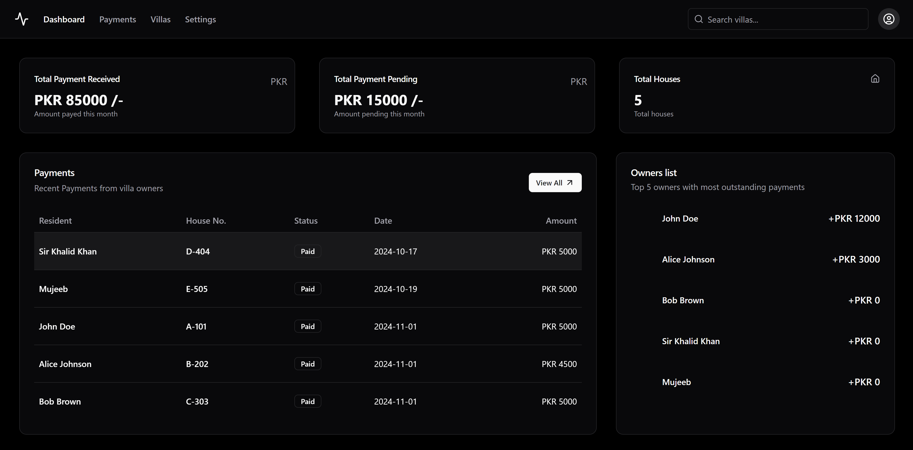

# Society Management App

## Overview
The Society Management App is designed to help society heads manage monthly payments and house details efficiently. This application aims to streamline the administrative tasks involved in managing a society.



## Features
- **User-Friendly Dashboard**: A comprehensive dashboard that shows analytics and important information.
- **Monthly Payments Management**: Track and manage monthly payments from residents.
  - **Payment History**: View the history of each house, including all previous payments and total outstanding payments.
  - **Receipt Download**: Download a receipt for each payment added.
- **House Details Management**: Maintain detailed records of each house in the society.
- **Resident Management**: Add, update, and remove resident information with ease.
- **Event Management**: Organize and manage society events and meetings.
- **Document Storage**: Securely store and access important documents related to the society.
- **Data Security**: Ensure data security with robust authentication and secure data storage practices.
- **Settings**: Update user information such as first name, last name, email, and password.
  - **PDF Export**: Option to get a PDF of all payments to date.

## Technology Stack
- **Frontend**: Built using Shadcn UI for a modern and responsive user interface.
  - **React**: For building the user interface.
  - **Redux**: For state management.
- **Backend**: Node.js and Express for robust server-side operations.
  - **SQLite**: For efficient data storage and retrieval.
- **Authentication**: Bcrypt to ensure password hash.

## Installation
1. Clone the repository:
  ```sh
  git clone https://github.com/mujeeb2003/Society-Management.git
  ```
2. Navigate to the project directory:
  ```sh
  cd Society-Management
  ```
3. Install dependencies:
  ```sh
  npm install
  ```

## Usage
1. Start the application:
  ```sh
  npm start 
  ```
2. Open your browser and navigate to `http://localhost:5173`.

## Contributing
Contributions are welcome! Please fork the repository and create a pull request with your changes.

## License
This project is licensed under the MIT License. See the [LICENSE](LICENSE) file for details.

## Contact
For any inquiries or feedback, please contact [mrehman0501305@gmail.com](mailto:mrehman0501305@gmail.com).

