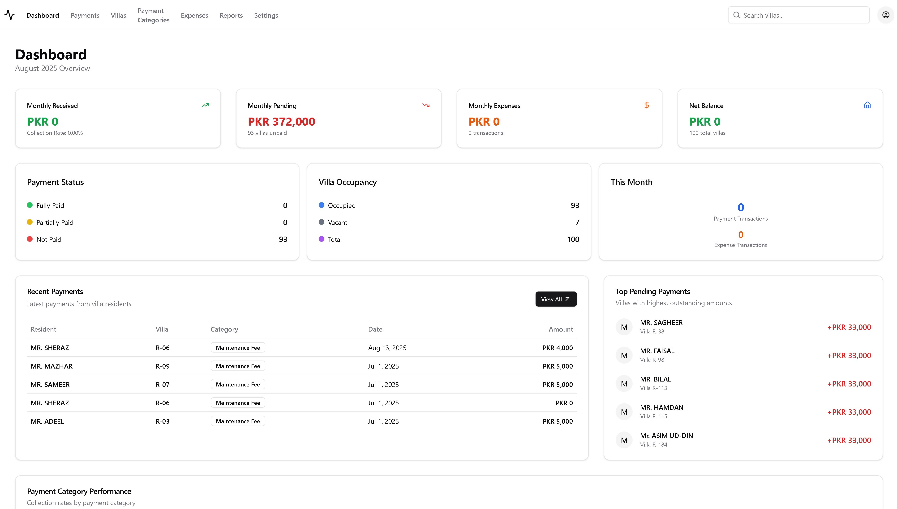

# Society Management App

## Overview
Society Management App is a comprehensive platform designed for society heads and management teams to efficiently handle all aspects of residential community administration. It streamlines payment collection, resident management, expense tracking, and reporting, providing a seamless experience for both managers and residents.



## Business Value
Society Management App is built for real-world society management, not just as a personal project. It empowers society heads and committees to:

- **Automate Payment Collection:** Track monthly, one-time, and pending payments with instant receipts and downloadable reports.
- **Increase Transparency:** Provide residents and management with clear payment histories, outstanding dues, and financial summaries.
- **Reduce Administrative Overhead:** Replace manual registers and spreadsheets with a unified digital solution.
- **Enable Data-Driven Decisions:** Use analytics and reports to plan budgets, monitor cash flow, and identify trends in expenses and collections.
- **Enhance Resident Experience:** Offer a modern, easy-to-use interface for payment, receipts, and communication.
- **Support Audits and Compliance:** Generate professional monthly and yearly reports for board meetings and regulatory needs.

## Features
- **Dashboard & Analytics:** Real-time overview of payments, expenses, balances, and resident activity.
- **Payments Management:**
  - Track monthly, one-time, and cross-month payments.
  - Add payments for previous months (with current date recorded).
  - Download PDF receipts for every payment.
  - View payment history and outstanding dues per villa.
- **Villa & Resident Management:**
  - Add, update, and manage villa details and resident information.
  - Mark villas as vacant or occupied.
- **Expense Tracking:**
  - Record expenses with category, amount, and description.
  - View monthly expense breakdowns and statistics.
- **Reports & Export:**
  - Generate monthly financial reports with villa-wise payment status, expense details, and cross-month payment summaries.
  - Export reports to Excel for further analysis.
- **Settings & Security:**
  - Update user profile and password.
  - Secure authentication and data protection.

## Technology Stack
- **Frontend:**
  - React (TypeScript)
  - Shadcn UI (modern, responsive components)
  - Redux Toolkit (state management)
- **Backend:**
  - Node.js & Express
  - Prisma ORM
  - MySQL
- **Authentication:**
  - Bcrypt (secure password hashing)
- **Reporting & Export:**
  - ExcelJS (professional Excel exports)
  - PDF receipts (react-pdf)

## Installation
1. Clone the repository:
   ```sh
   git clone https://github.com/mujeeb2003/Society-Management.git
   ```
2. Navigate to the project directory:
   ```sh
   cd Society-Management
   ```
3. Install dependencies:
   ```sh
   npm install
   ```

## Usage
1. Start the backend server:
   ```sh
   npm run server
   ```
2. Start the frontend:
   ```sh
   npm run dev
   ```
3. Open your browser and navigate to `http://localhost:5173`.

## Contributing
Contributions are welcome! Please fork the repository and create a pull request with your changes.

## License
This project is licensed under the MIT License. See the [LICENSE](LICENSE) file for details.

## Contact
For any inquiries or feedback, please contact [mrehman0501305@gmail.com](mailto:mrehman0501305@gmail.com).

